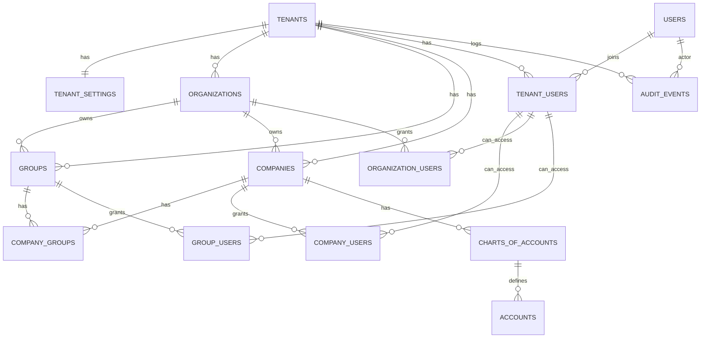

# Modelo Canonico — Central de Cadastramento (TermoFlow)

Este documento descreve as entidades canonicas (PostgreSQL/Prisma) e regras de visibilidade para um SaaS multi-tenant.

Pilares:
- Isolamento por `tenant` (obrigatorio).
- Visibilidade operacional por `empresa` (obrigatoria), com camadas opcionais `organizacao` e `grupo`.
- COA (Plano de Contas) altamente parametrizavel (codigos manuais e/ou gerados, incluindo strings livres).

## Definicoes

- **Tenant (obrigatorio)**: cliente do SaaS. Tudo pertence a um tenant.
- **Organizacao (opcional)**: camada holding/rede que pode agrupar empresas e grupos.
- **Grupo (opcional)**: agrupamento logico de empresas (regiao, tipo, etc.). Normalmente vinculado a uma organizacao.
- **Empresa (obrigatorio)**: unidade operacional/legal. Quase tudo operacional deve amarrar em `company_id`.

## Regras globais de modelagem (padrao B2B)

### Colunas padrao (tabelas de negocio)

Em todas as tabelas tenant-scoped:
- `id` (UUID)
- `tenant_id` (UUID) NOT NULL
- `created_at`, `updated_at`
- `deleted_at` (se usar soft delete)
- `created_by_user_id`, `updated_by_user_id` (auditoria)

### Unicidade/indices sempre com tenant

Qualquer "unico" deve ser unico dentro do tenant, nunca global:
- Ex.: `UNIQUE (tenant_id, document_no)`

> Observacao sobre soft delete: para manter unicidade apenas para registros ativos, use indices unicos parciais
> (`WHERE deleted_at IS NULL`). O Prisma nao gera indice parcial via schema; precisa de SQL manual.

## Feature flags (Organizacao/Grupo)

Tabela `tenant_settings` (1:1 com `tenants`):
- `use_organizations` (bool)
- `use_groups` (bool)

Regras:
- Se `use_organizations=false`, `organization_id` pode ser `NULL` e nao aparece na UI/API.
- Se `use_organizations=true`, `companies.organization_id` e `groups.organization_id` sao obrigatorios.
- Se `use_groups=false`, nao existe agrupamento/visibilidade por grupos.

## Entidades canonicas (visao geral)

### Corporativo (estrutura)

- `tenants`
- `tenant_settings`
- `organizations` (opcional por tenant)
- `groups` (opcional por tenant; opcionalmente vinculado a `organizations`)
- `companies` (obrigatorio por tenant)
- `company_groups` (N:N entre companies e groups)

**Organizations (campos principais)**
- `id`, `tenant_id`
- `code` (string livre; unico por tenant quando preenchido)
- `name`
- `status` (ACTIVE/INACTIVE)

### Identidade e acesso (visibilidade)

- `users` (identidade global)
- `tenant_users` (vinculo do usuario ao tenant)
- `company_users` (vinculo do tenant_user as empresas)
- `organization_users` (vinculo do tenant_user as organizacoes)
- `group_users` (vinculo do tenant_user aos grupos)

### Auditoria (quem/quando/o que)

- Colunas `created_by_user_id` / `updated_by_user_id` em todas as tabelas tenant-scoped
- `audit_events` (log CREATE/UPDATE/DELETE com `actor_user_id`, entidade e diff em JSON)

### COA / Plano de Contas

- `charts_of_accounts` (configuracoes e estrategia de codigo por empresa)
- `accounts` (contas hierarquicas; codigo livre com normalizacao + unicidade por empresa)

## Regras de visibilidade (modelo mental)

### Contexto minimo (sempre presente na request)

- `tenant_id` (obrigatorio)
- `tenant_user_id` (usuario dentro do tenant)
- `company_id` (empresa ativa no contexto) **OU** `company_ids` (lista de empresas visiveis)

### Calculo de empresas visiveis

1. Se `tenant_user.role in (OWNER, ADMIN)` => pode ver todas as empresas do tenant.
2. Caso contrario, `visible_companies` = uniao de:
   - empresas explicitamente vinculadas em `company_users`
   - empresas da(s) organizacao(oes) vinculada(s) em `organization_users` (se `use_organizations=true`)
   - empresas pertencentes a grupos vinculados em `group_users` (se `use_groups=true`)

### Aplicacao nas tabelas operacionais

Regra padrao para leitura/escrita:
- `tenant_id = ctx.tenant_id`
- `company_id IN ctx.visible_companies` (quando a tabela for company-scoped)

## Diagrama (alto nivel)

## Notas de implementacao (Prisma)

- Schema proposto em `prisma/schema.prisma`.
- Recomendacoes:
  - normalizar codigos (`code_normalized`) para garantir unicidade case-insensitive;
  - criar indices unicos parciais para soft delete (se aplicavel);
  - centralizar visibilidade em repositories (sempre exigindo `tenant_id` e `company_id`).

